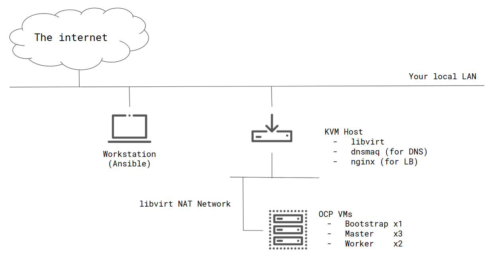

# openshift-ansible-kvm

This repository contains Ansible playbooks for UPI installation of OpenShift 4 on KVM.


## Requirements

- Workstation, A machine that runs Ansible. It is typically your laptop
    - Ansible >= 2.8
    - You can simply run ansible on the KVM host if you want. Without a workstation.
- KVM host
    - RHEL 8.2
    - CPU with at least 4 cores
    - 80 GB or more memory recommended

## Architecture



It can also be run with just a KVM host, without a workstation. (In that case, install Ansible on the KVM host)

## Quickstart

### Install ansible on your Workstation

```bash
$ sudo dnf install -y ansible
```

### Prepare KVM host

- Just install RHEL8
- Add workstation's ssh public key to root's `.ssh/authorized_keys`

### Make your settings

Create your settings based on the samples.
At least change the following settings are required.

- vars/config.yml
    - `kvm_host.ip` : your kvm host ip
    - `kvm_host.if` : your kvm host if name (e.g. `enp2s0f0` )
    - `pullsecret`  : get from [cloud.redhat.com](https://cloud.redhat.com/openshift/install/metal/user-provisioned)
    - `sshkey`      : your ssh pub key
- inventory/hosts
    - `kvm_host`    : your kvm host ip

```bash
$ cp vars/config.yml.sample vars/config.yml
$ cp inventory/hosts.sample inventory/hosts
```

### Run the playbook

```bash
$ ansible-playbook ./main.yml
```

### Something is wrong? - clean up environment

```bash
$ ansible-playbook ./03_cleanup.yml
```

